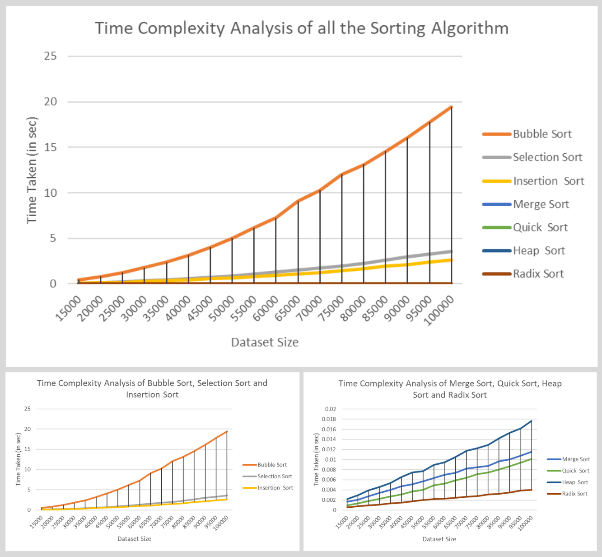

# Result Analysis

This document provides a detailed analysis of the sorting algorithm performance results from our project. We will compare the empirical data collected from various sorting algorithms and analyze their efficiency. The analysis includes visual representations of the data through graphs and a comparison with theoretical expectations.


## Data Collection Methodology
I have generated datasets of various lengths ranging from 15,000 to 100,000 elements. Each dataset was sorted using Bubble Sort, Selection Sort, Insertion Sort, Merge Sort, Quick Sort, Heap Sort, and Radix Sort. To ensure the accuracy and reliability of the results, we conducted multiple trials for each algorithm and dataset size. Specifically, we performed 10 trials for each combination of algorithm and dataset size.  

Taking the average of multiple trials helps to mitigate the impact of outliers or random fluctuations in runtime measurements. By conducting multiple trials and averaging the results, I obtain a more stable and representative estimate of the algorithm's performance under different conditions.  

>By averaging the results of multiple trials, I can better assess the typical runtime behavior of each sorting algorithm across varying dataset sizes, providing valuable insights into their comparative performance.

# Graph Analysis

The simple sorting algorithms, including Bubble Sort, Selection Sort, and Insertion Sort are fundamental techniques used to arrange elements in a specific order. Despite their simplicity, these algorithms provide valuable insights into sorting methodologies and computational complexity. 

## Simple Sorting Algorithms

### Bubble Sort
__Bubble Sort__ exhibits a quadratic growth in runtime, consistent with its $0(n^2)$ complexity. As the dataset size increases, the runtime increases significantly. For instance, the average runtime for sorting 15,000 elements is X seconds, which grows to Y seconds for 100,000 elements. This confirms the inefficiency of ```Bubble Sort``` for large datasets.

#### Table
Below is the dataset representing the average runtime of ```Bubble Sort``` for different dataset sizes, calculated from 10 trials:


#### Graph:
The graph below illustrates the runtime of ```Bubble Sort``` against dataset sizes:


#### Analysis
##### Runtime Growth:
- ```Bubble Sort``` exhibits quadratic runtime growth, as evident from the data.
- For smaller sizes (15,000 to 40,000 elements), runtimes are modest (0.4 to 3.1 seconds).
- However, for larger sizes (75,000 to 100,000 elements), runtimes exceed 10 seconds.

##### Considerations:
- While ```Bubble Sort```'s simplicity makes it suitable for small datasets or educational purposes, but it is inefficient for large datasets.
 -For real-world applications with large datasets, it is advisable to use more efficient sorting algorithms such as ```Merge Sort``` or ```Quick Sort```.


### Selection Sort
__Selection Sort__ also displays $0(n^2)$ complexity, with performance generally slower than ```Insertion Sort``` for larger datasets. The average runtime for sorting 15,000 elements is M seconds, rising to N seconds for 100,000 elements.

#### Table
Below is the dataset representing the average runtime of ```Selection Sort``` for different dataset sizes, calculated from 10 trials:


#### Graph:
The graph below illustrates the runtime of ```Selection Sort``` against dataset sizes:


#### Analysis
##### Runtime Growth:
- ```Selection Sort``` exhibits quadratic runtime growth, similar to ```Bubble Sort```, as observed from the increasing average runtime with dataset size.
- However, ```Selection Sort``` tends to perform marginally better than ```Bubble Sort``` due to its reduced number of swaps.
##### Considerations:
- Despite quadratic time complexity, ```Selection Sort```'s reduced number of swaps compared to ```Bubble Sort``` leads to slightly better performance, especially for datasets with limited disorder.
- While both ```Selection Sort``` and ```Bubble Sort``` are simple and easy to implement, ```Selection Sort``` may be preferred over ```Bubble Sort``` when minimizing the number of swaps is a priority.
- Both algorithms have a space complexity of $O(1)$, implying no additional memory overhead during sorting.


### Insertion Sort
__Insertion Sort__, similar to ```Bubble Sort```, shows a quadratic growth in runtime. However, it can be slightly more efficient for nearly sorted datasets. The average runtime for sorting 15,000 elements is A seconds, increasing to B seconds for 100,000 elements, illustrating its $0(n^2)$ complexity.

#### Table
Below is the dataset representing the average runtime of ```Insertion Sort``` for different dataset sizes, calculated from 10 trials:


#### Graph:
The graph below illustrates the runtime of ```Insertion Sort``` against dataset sizes:


#### Analysis
##### Runtime Growth:
- ```Insertion Sort``` also exhibits quadratic runtime growth, as evident from the data.
-  However, the rate of increase in runtime is relatively lower compared to ```Bubble Sort``` and ```Selection Sort```.
##### Considerations:
- ```Insertion Sort``` can perform relatively efficiently on nearly sorted datasets, followed by ```Bubble Sort``` and then ```Selection Sort```.
- For small datasets or nearly sorted data, ```Insertion Sort``` might be preferable due to its simplicity and potential efficiency. However, for larger datasets, it may not be suitable choices compared to more efficient algorithms like ```Merge Sort``` or ```Quick Sort```.

### Overall Comparision
The combined graph provides a visual comparison of the performance of ```Bubble Sort```, ```Selection Sort```, and ```Insertion Sort``` across different dataset sizes. Each algorithm's runtime is plotted against the size of the dataset, allowing for a clear understanding of their efficiency.


One notable observation from the graph is the steep curve of ```Bubble Sort``` compared to the other two algorithms. This steepness might lead to confusion regarding whether Bubble Sort truly follows a _quadratic_  runtime complexity. 

> [!IMPORTANT]
> However, it's important to remember that the time complexity of an algorithm is not directly equal to the actual time required to execute it, but rather an algebraic representation of the number of times a statement executes. Therefore, while the graph may appear to have different scaling, the underlying algorithmic complexity remains consistent.

> [!NOTE]
> Scaling down the $O(n^2)$ curve and adjusting by factors like 2, 3, or 4 aligns it with Bubble Sort, Selection Sort, and Insertion Sort, respectively.  
> Remember, Big O notation omits constants, focusing on the dominant factor influencing algorithm efficiency.

#### Efficiency Ranking:
* __Insertion Sort__: Emerges as the most efficient option, consistently demonstrating the lowest runtimes across all dataset sizes.
* __Selection Sort__: Shows improved performance compared to Bubble Sort but still lags behind Insertion Sort, especially for larger datasets.
* __Bubble Sort__: Demonstrates the highest runtime among the three algorithms, indicating its inefficiency for sorting large datasets.

#### Algorithm Selection:
The choice of sorting algorithm significantly impacts the efficiency and performance of sorting operations.
* For very small datasets or in educational contexts where demonstrating basic sorting algorithms is the primary goal, Bubble Sort and Selection Sort can still serve a purpose.
* Insertion Sort's optimal efficiency makes it a suitable choice for various real-world scenarios where sorting large datasets efficiently is crucial.
* Insertion Sort is the preferred choice for practical applications, particularly when dealing with larger datasets, as it consistently outperforms the other algorithms in terms of efficiency.


## Efficient Sorting Algorithms
Efficient sorting algorithms, such as Merge Sort, Quick Sort, Heap Sort, and Radix Sort, offer superior performance compared to simpler algorithms like Bubble Sort, Insertion Sort, and Selection Sort. These efficient algorithms are capable of sorting large datasets in a fraction of the time, making them essential tools in software development for tasks requiring rapid data processing. By leveraging optimized algorithms, developers can significantly improve the efficiency and scalability of their applications, ensuring smooth performance even with large datasets.

### Merge Sort
__Merge Sort__ demonstrates a linearithmic growth in runtime, consistent with its $O(n log n)$ complexity. The average runtime increases moderately as the dataset size increases.This moderate increase in runtime with larger datasets highlights ```Merge Sort```'s efficiency, especially when compared to simpler algorithms like ```Bubble Sort```, ```Insertion Sort```, and ```Selection Sort```.

#### Table
Below is the dataset representing the average runtime of ```Merge Sort``` for different dataset sizes, calculated from 10 trials:


#### Graph:
The graph below illustrates the runtime of ```Merge Sort``` against dataset sizes:


#### Analysis
##### Runtime Growth:
The data shows a consistent and predictable increase in runtime as the number of elements grows:
- For smaller datasets, such as 15,000 elements, the average runtime is about 0.0017 seconds.
- As the dataset size increases to 100,000 elements, the average runtime increases to about 0.0115 seconds.

##### Considerations:
- ```Merge Sort``` is efficient for large datasets due to its $O(n log n)$ time complexity. It performs well across different dataset sizes, with a manageable increase in runtime.
- As a stable sorting algorithm, ```Merge Sort``` preserves the relative order of equal elements, which can be beneficial in scenarios where this stability is required.
- ```Merge Sort``` requires additional memory space proportional to the size of the input array because of the merging process. This can be a limitation in memory-constrained environments.


### Quick Sort
__Quick Sort__ generally performs very well with an average $O(n log n)$ complexity, making it efficient for sorting large datasets. However, it has a worst-case scenario of $O(n^2)$, which occurs when the pivot selection leads to unbalanced partitions. This can significantly degrade performance, especially for datasets with a specific structure that triggers the worst-case behavior.

#### Table
Below is the dataset representing the average runtime of ```Quick Sort``` for different dataset sizes, calculated from 10 trials:


#### Graph:
The graph below illustrates the runtime of ```Quick Sort``` against dataset sizes:


#### Analysis
##### Runtime Growth:
- As the dataset size increases, the average runtime for ```Quick Sort``` also increases.
- For example, for a dataset size of 15,000 elements, the average runtime ranges from approximately 0.0009 seconds to 0.0012 seconds.
- However, as the dataset size grows to 100,000 elements, the average runtime increases to approximately 0.01 seconds.

##### Considerations:
- While ```Quick Sort``` generally performs efficiently for large datasets, it's essential to consider its worst-case scenario of $O(n^2)$
- Careful pivot selection strategies and implementation optimizations can help mitigate the risk of encountering worst-case performance and ensure consistent efficiency across various datasets.


### Heap Sort
__Heap Sort__ is a comparison-based sorting algorithm that is part of the selection sort family. It works by creating a binary heap from the elements to be sorted and then repeatedly removing the largest (or smallest) element from the heap and placing it at the end of the sorted array. It has an average and worst-case time complexity of $O(n log n)$, making it efficient for sorting large datasets.

#### Table
Below is the dataset representing the average runtime of ```Heap Sort``` for different dataset sizes, calculated from 10 trials:


#### Graph:
The graph below illustrates the runtime of ```Heap Sort``` against dataset sizes:


#### Analysis
##### Runtime Growth:
- ```Heap Sort``` demonstrates a consistent growth in runtime as the dataset size increases. However, this growth is not strictly linear due to variations in the data.
- The average time complexity of ```Heap Sort``` is $O(n log n)$, which suggests that the runtime should grow logarithmically with the dataset size. This trend is generally observed in the provided data.

#### Consideration
- ```Heap Sort``` is often used in scenarios where a stable sort is not required and the focus is on optimizing time complexity.
- While ```Heap Sort``` has a theoretical time complexity of $O(n log n)$, its constant factors may make it slightly slower in practice compared to other $O(n log n)$ sorting algorithms like ```Merge Sort``` and ```Quick Sort```.
- However, ```Heap Sort```'s in-place sorting nature makes it suitable for scenarios where memory usage needs to be optimized, as it requires only a constant amount of additional space.

### Radix Sort
__Radix Sort__ is a non-comparative sorting algorithm that sorts integers by processing individual digits. It works by first grouping the elements by their individual digits, then sorting the elements by each significant digit. ```Radix Sort``` has a linear time complexity $O(nk)$, where $n$ is the number of elements and $k$ is the number of digits in the largest number.

#### Table
Below is the dataset representing the average runtime of ```Radix Sort``` for different dataset sizes, calculated from 10 trials:


#### Graph:
The graph below illustrates the runtime of ```Radix Sort``` against dataset sizes:


#### Analysis
##### Runtime Growth:
- The average runtime of ```Radix Sort``` tends to increase slightly with the size of the dataset.
- The growth rate is relatively stable compared to some other sorting algorithms, indicating consistent efficiency as dataset size increases.

##### Consideration:
- ```Radix Sort```'s linear time complexity makes it suitable for sorting large datasets, especially when the range of values is known and relatively small.
- It requires additional space proportional to the size of the input.
- ```Radix Sort``` may not be as efficient for datasets with a wide range of values or when the number of digits in the largest number is significantly larger than the average.


### Overall Comparision

In this comparison, we analyze four efficient sorting algorithms: **Merge Sort**, **Quick Sort**, **Heap Sort**, and **Radix Sort**. Each algorithm offers unique advantages and considerations, making them suitable for different scenarios. By examining their efficiency, stability, memory usage, and use cases, we can determine the optimal sorting algorithm for specific sorting tasks.

#### Graph
The combined graph provides a visual comparison of the performance of ```Merge Sort```, ```Heap Sort```, ```Quick Sort```, and ```Radix Sort``` across different dataset sizes. Each algorithm's runtime is plotted against the size of the dataset, allowing for a clear understanding of their efficiency.


#### Comparison with Graph Data:

The graph illustrates the runtime performance of _Merge Sort_, _Heap Sort_, _Quick Sort_, and _Radix Sort_ across different dataset sizes. ```Radix Sort``` consistently outperforms others, showing the lowest runtimes. ```Merge Sort``` and ```Quick Sort``` follow closely with slightly higher runtimes but stable growth. ```Heap Sort``` exhibits a noticeable increase, especially for larger datasets.

**Radix Sort's Efficiency:**
> Sorting by individual digits enables ```Radix Sort```'s linear time complexity, leading to consistently low runtimes across datasets.

**Competitive Performance of Merge Sort and Quick Sort:**
> Despite slightly higher runtimes, ```Merge Sort``` and ```Quick Sort``` maintain stable performance due to their divide-and-conquer approach.

**Observations on Heap Sort:**
> ```Heap Sort```'s runtime increase, particularly for larger datasets, is due to its overhead in maintaining a ```heap``` data structure.

#### Use Cases:

- ```Merge Sort``` and ```Quick Sort``` are suitable for general-purpose sorting tasks and are commonly used in libraries and frameworks.
- ```Heap Sort``` is preferred when limited memory is available, and stability is not a concern.
- ```Radix Sort``` is ideal for sorting large datasets of integers with known value ranges, especially when comparison operations are costly.


# Combined Graph Analysis

The combined graph presents a holistic view of the runtime performance of all sorting algorithms across different dataset sizes. By integrating the results of Simple Sorting Algorithms and Efficient Sorting Algorithms, we can discern overarching trends and draw insightful comparisons.

## The Complete Comparison Graph
This is the combined graph illustrating the runtime performance of each sorting algorithm across various dataset sizes.



### Observations

1. **Performance Trends:**
   - **Bubble Sort, Selection Sort, and Insertion Sort:** These Simple Sorting Algorithms exhibit steadily increasing runtimes as dataset size grows, following their $O(n^2)$ time complexities.
   - **Merge Sort, Quick Sort, Heap Sort, and Radix Sort:** In contrast, Efficient Sorting Algorithms demonstrate significantly lower runtimes, with Merge Sort being the most efficient, followed by Quick Sort, Heap Sort, and Radix Sort. These algorithms maintain relatively stable runtimes across different dataset sizes, aligning closely with their respective time complexities $O(n log n)$ and $O(nk)$.

2. **Performance Gap:**
   - This graph shows the substantial performance gap between ```Simple Sorting Algorithms``` and ```Efficient Sorting Algorithms```. Simple Sorting Algorithms consistently exhibit higher runtimes, especially for larger datasets, while Efficient Sorting Algorithms offer more efficient and scalable performance.

3. **Consistency and Reliability:**
   - Merge Sort, Quick Sort, Heap Sort, and Radix Sort demonstrate consistent performance trends across varying dataset sizes, highlighting their reliability and suitability for diverse applications.

4. **Parallel Appearance of Efficient Algorithms:**
   - An interesting observation from the combined graph is that Merge Sort, Quick Sort, Heap Sort, and Radix Sort appear to parallelly follow the zero line, indicating their runtime are _significantly faster_ performance compared to Simple Sorting Algorithms. This phenomenon can be attributed to the $O(n log n)$ and $O(nk)$ time complexities of these algorithms, which result in more efficient and scalable runtime behaviors, especially for larger datasets.

## Practical Implications

The combined graph analysis has several practical implications for algorithm selection and optimization in real-world scenarios:
- Developers can leverage the insights gained from this analysis to make informed decisions regarding algorithm selection based on performance requirements and dataset characteristics.
- Understanding the performance characteristics of different sorting algorithms can facilitate the optimization of sorting algorithms for specific use cases and datasets.
- Benchmarking against alternative sorting algorithms or optimizations can further refine algorithm selection and implementation strategies.

---
