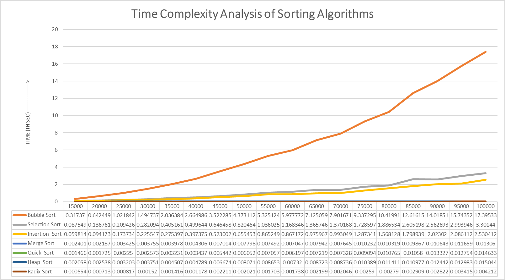

# Sorting Algorithms in C

This repository contains implementations of various sorting algorithms in C. The project aims to analyze and compare the time complexities of these algorithms. The results will be noted and used to create a graph for visualization. This is a work in progress.

## Table of Contents

- [Introduction](#introduction)
- [Algorithms](#algorithms)
  - [Bubble Sort](#bubble-sort)
  - [Selection Sort](#selection-sort)
  - [Insertion Sort](#insertion-sort)
  - [Merge Sort](#merge-sort)
  - [Quick Sort](#quick-sort)
  - [Heap Sort](#heap-sort)
  - [Radix Sort](#radix-sort)
  - [Bucket Sort](#bucket-sort)
- [Comparison Table](#comparison-table)
- [Actual Program](#actual-program)
  - [Repository Link](#repository-link)
  - [Files](#files)
  - [Output](#output)
  - [Performance Graph](#performance-graph)
- [License](#license)

## Introduction

Sorting algorithms are methods used to order the elements of a list in a specific sequence, most commonly in ascending or descending order. This project implements various sorting algorithms in C and compares their time complexities. The results will be used to create a graphical representation of their performance.

## Algorithms

### Bubble Sort

Bubble Sort is a simple comparison-based algorithm in which each pair of adjacent elements is compared and the elements are swapped if they are not in order. This process is repeated until no swaps are needed, which means the list is sorted. It is known for its simplicity but is inefficient for large datasets.

### Selection Sort

Selection Sort segments the list into two parts: sorted and unsorted. It repeatedly removes the smallest element of the unsorted segment and appends it to the sorted segment. Like Bubble Sort, it is quite inefficient for large datasets.

### Insertion Sort

Insertion Sort builds the final sorted array one item at a time. It is less efficient on large lists than more advanced algorithms such as quicksort, heapsort, or merge sort. However, it has advantages for small datasets and nearly sorted lists.

### Merge Sort

Merge Sort is a divide and conquer algorithm that divides the input array into two halves, calls itself for the two halves, and then merges the two sorted halves. It is very efficient and has a consistent running time, but requires additional space proportional to the array size.

### Quick Sort

Quick Sort is another divide and conquer algorithm that picks an element as a pivot and partitions the given array around the picked pivot. There are many different versions of quicksort that pick the pivot in different ways. It has better space complexity than merge sort and is often faster in practice.

### Heap Sort

Heap Sort is based on a binary heap data structure. It creates a max heap from the array and then repeatedly extracts the maximum element from the heap, and replaces it with the last element of the heap followed by readjusting the heap. It is very efficient and does not require additional array storage.

### Radix Sort

Radix Sort implements a digit-by-digit sort starting from the least significant digit to the most significant digit. Radix sort uses counting sort as a subroutine to sort.

### Bucket Sort

Bucket Sort distributes the elements of an array into a number of buckets. Each bucket is then sorted individually, either using a different sorting algorithm or by recursively applying the bucket sort algorithm.

## Comparison Table

| Algorithm     | Time Complexity (Best) | Time Complexity (Average) | Time Complexity (Worst) | Space Complexity | Stable | In-place |
| ------------- | ---------------------- | ------------------------- | ----------------------- | ---------------- | ------ | -------- |
| Bubble Sort   | O(n)                   | O(n^2)                    | O(n^2)                  | O(1)             | Yes    | Yes      |
| Selection Sort| O(n^2)                 | O(n^2)                    | O(n^2)                  | O(1)             | No     | Yes      |
| Insertion Sort| O(n)                   | O(n^2)                    | O(n^2)                  | O(1)             | Yes    | Yes      |
| Merge Sort    | O(n log n)             | O(n log n)                | O(n log n)              | O(n)             | Yes    | No       |
| Quick Sort    | O(n log n)             | O(n log n)                | O(n^2)                  | O(log n)         | No     | Yes      |
| Heap Sort     | O(n log n)             | O(n log n)                | O(n log n)              | O(1)             | No     | Yes      |
| Radix Sort    | O(nk)                  | O(nk)                     | O(nk)                   | O(n+k)           | Yes    | No       |

>**Key**:
> - **n**: Number of elements in the array
> - **k**: The range of the input
> - **Stable**: A sorting algorithm is stable if it preserves the relative order of equal elements
> - **In-place**: A sorting algorithm is in-place if it uses a constant amount of extra space


## Actual Program

### Repository Link

You can view the entire repository on GitHub by clicking [here](https://github.com/Sabircodr/sortAlgo).
>[!TIP] 
>You can run the program on Replit by clicking this link: [Run on Replit](https://replit.com/@SabirMallick/JProject)  

### Files

- [basic_sort.h](sort/basic_sort.h): Header file containing implementations of basic sorting algorithms such as insertion sort, selection sort, and bubble sort.
- [heap_sort.h](sort/heap_sort.h): Header file containing the implementation of the heap sort algorithm.
- [merge_sort.h](sort/merge_sort.h): Header file containing the implementation of the merge sort algorithm.
- [quick_sort.h](sort/quick_sort.h): Header file containing the implementation of the quick sort algorithm.
- [radix_sort.h](sort/radix_sort.h): Header file containing the implementation of the radix sort algorithm.
- [extras.h](sort/extras.h): Header file containing any extra functions that may be needed like ```print(arr[],n)```, ```swap(a,b)```, etc.
- [MAIN.c](MAIN.c): Main program file that includes all the header files and runs the sorting algorithms.


In the diagram below, you can see the dependencies between the main program file (`MAIN.c`) and various header files containing implementations of different sorting algorithms. Each header file corresponds to a specific sorting algorithm and is included in the main program file to utilize its functions.


### Output

One of the outputs generated by the program. This output demonstrates the effectiveness of the implemented sorting algorithms and provides insights into their performance characteristics.

```
Size        Bubble      Select      Insert      Merge       Quick       Heap        Radix
15000       0.317370    0.087549    0.059814    0.002401    0.001466    0.002058    0.000554
20000       0.642449    0.136761    0.094173    0.002187    0.001725    0.002538    0.000713
25000       1.021842    0.209426    0.173734    0.003425    0.002250    0.003203    0.000817
30000       1.494737    0.282094    0.225547    0.003755    0.002573    0.003751    0.001520
35000       2.036384    0.405161    0.275397    0.003978    0.003231    0.004507    0.001416
40000       2.664986    0.499644    0.397375    0.004306    0.003437    0.004789    0.001178
45000       3.522285    0.646458    0.523002    0.007014    0.005442    0.006674    0.002211
50000       4.373112    0.820464    0.655453    0.007798    0.006052    0.008071    0.002021
55000       5.325124    1.036025    0.865249    0.007492    0.007057    0.008653    0.001703
60000       5.977772    1.168346    0.867172    0.007047    0.006197    0.007320    0.001738
65000       7.125059    1.365746    0.975967    0.007942    0.007219    0.008723    0.002199
70000       7.901671    1.370168    0.993049    0.007645    0.007328    0.008736    0.002046
75000       9.337295    1.728597    1.287341    0.010232    0.009094    0.010389    0.002590
80000       10.419905   1.886534    1.568128    0.010319    0.010765    0.011411    0.002790
85000       12.616153   2.605198    1.798939    0.009867    0.010580    0.010977    0.002909
90000       14.018509   2.562693    2.023020    0.010643    0.013327    0.012442    0.002822
95000       15.743518   2.993946    2.086112    0.011659    0.012754    0.012983    0.003415
100000      17.395332   3.301440    2.530412    0.013060    0.014633    0.015044    0.004212
```
> [!NOTE]
> There is a ```print(int arr[], int size)``` function, to print the contents of the array whenever the user wants.

### Performance Graph

The following graph illustrates the time taken by each sorting algorithm to sort a dataset. This visual representation helps in comparing the performance and efficiency of the different sorting algorithms implemented in this project.

In this graph, you can see how each algorithm performs with respect to time complexity when sorting the dataset. The x-axis represents the sorting algorithms, while the y-axis represents the time taken to sort the dataset.
> [!IMPORTANT]
> We can see that only Bubble Sort, Selection Sort, and Insertion Sort have visible lines, while the rest are along the zero-second line. This is because the rest of the algorithms are much faster compared to these three. I have done a detailed analysis of the graph of these sorting algorithms and their time complexity. Click ___this link___ to see.

## License

This project is licensed under the MIT License. See the [LICENSE](LICENSE.md) file for details.

---

Feel free to contact us if you have any questions or suggestions regarding the repository. Happy sorting!
